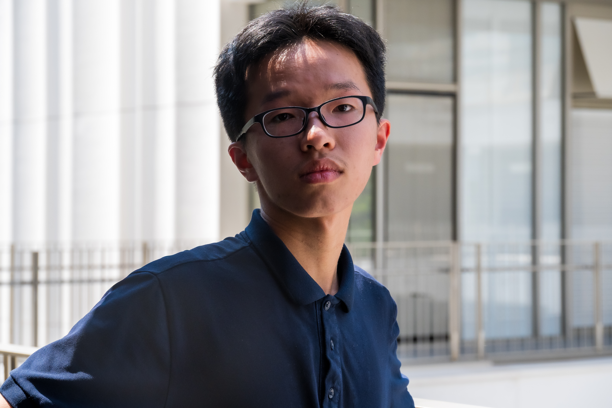

<table style="border-radius: 20px; overflow: hidden">
  <tr>
    <td width="40%">
      
    </td>
    <td>
      <h1>👋在下郑宇轩~ <em>Hi, Yuxuan Zheng Here.</em></h1>
一位有志保研去浙大控院的有志青年 An aspiring young student who fought his way to ZJU 一位吃了太多蔬菜的退役OIer A retired OIer who ate too many vegetables 一位打算进自动化专业的大一NKDer A Sustech freshman planning to apply to Automation Engineering 一头忙忙碌碌的牛马努力抽出时间打全国大学生机器人大赛 A busyyyyyyy bee manages to squeeze in time to participate in Robocon

    </td>
  </tr>
</table>

### 💯我擅长的 | Tech Stack

 &  & 

---

### ✍ 正在学习 | Studying On

 &  & 

---

### 💖小有作为 | Outstanding Project

[中国象棋 | ChineseChess](https://github.com/BetterOIer/ChineseChess)

[谷歌小恐龙 | GoogleDino](https://github.com/BetterOIer/GoogleDino)

[书图同归 | Bookture](https://github.com/BetterOIer/Bookture)

[远程唤醒 | Wake On Lan](https://github.com/BetterOIer/gCPP_Code/tree/master/Project/WOL_GUI)

---

### 💬欢迎交流 | I'm Here To Chat

  
相信对的人，会站在我的前途里  
——椿去湫来，你我终会相见——  
Sincerely looking for a girlfriend   
to share with me one love one lifetime

<!--
$$\LARGE{\textbf{Tech Stack}}$$

-->

### ⚙️ 贡献数据/Statistics

  

<!--

  

  
  

-->
